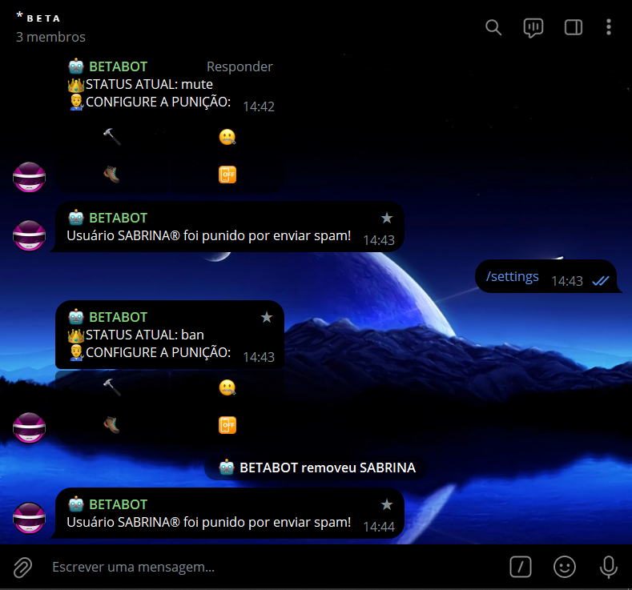
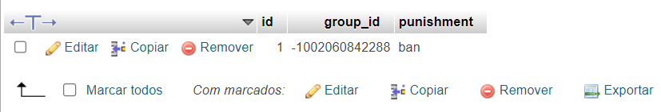

# MODERADOR ANTISPAM SQL
🛑ESSE É UM BOT DO TELEGRAM QUE PENALISA OS MEMBROS QUE ENVIAREM SPAM (COM PERSONALIZAÇÃO VIA MYSQL)!

 <br>
 <br>

## DESCRIÇÃO:
Este bot implementa uma funcionalidade de configuração de punições para um grupo de Telegram. Ele permite que administradores do grupo configurem diferentes tipos de punições para usuários que enviam spam, como banimento, silenciamento, expulsão do grupo, ou desativar a punição.

## RECURSOS:
1. Quando um administrador do grupo digita o comando `/settings`, o bot verifica se o remetente é um administrador do grupo. Se for, ele busca a punição atualmente configurada para o grupo no banco de dados e exibe um painel de botões com opções de punição: banir, silenciar, expulsar ou desligar a função anti-spam.

2. Quando um administrador do grupo seleciona uma opção de punição no painel de botões, essa escolha é salva no banco de dados associado ao ID do grupo. Em seguida, a punição é aplicada ao membro alvo, se apropriado.

3. O bot também monitora mensagens de texto no grupo. Se detectar a presença de links em mensagens de não-administradores, o bot remove a mensagem e aplica a punição configurada para o grupo.

4. As configurações de punição são personalizáveis para cada grupo, permitindo que diferentes grupos tenham diferentes níveis de tolerância ao spam.

## PROCEDIMENTO DE COMPRA:
- O valor deste bot é de R$ 3.500,00.
- Para efetuar a compra, por favor, entre em contato comigo por mensagem privada, informando:
    ```bash
    Gostaria de adquirir o bot: https://github.com/VILHALVA/MODERADOR-ANTISPAM-SQL
    ```
- Após a confirmação do pagamento e o envio do comprovante, você receberá um arquivo zip contendo o código-fonte do bot, acompanhado de um manual detalhado (`MANUAL.md`), que oferece instruções abrangentes sobre a configuração do ambiente, sugestões de cursos e documentação recomendada, bem como o arquivo `HOSPEDAGEM.md`, contendo orientações para hospedar o seu bot.
- Caso deseje serviços adicionais, como configuração do bot ou teste VIP, será aplicada uma taxa adicional de R$ 100,00 ao custo do bot.
- Se optar por adicionar mais recursos ou funcionalidades ao projeto, será aplicada uma taxa adicional de R$ 200,00 para cada novo recurso ou funcionalidade.
- [🤑CLIQUE AQUI PARA ENTRAR EM CONTATO](https://t.me/VILHALVA100)
- [🧑‍💻PRECISA DE UM FREELANCER? CLIQUE AQUI PARA VER EM TELEGRAPH](https://telegra.ph/FREELANCER-10-19-9)
- [🧑‍💻PRECISA DE UM FREELANCER? CLIQUE AQUI PARA VER EM README](https://github.com/VILHALVA/VILHALVA/blob/main/FREELANCER/README.md)


