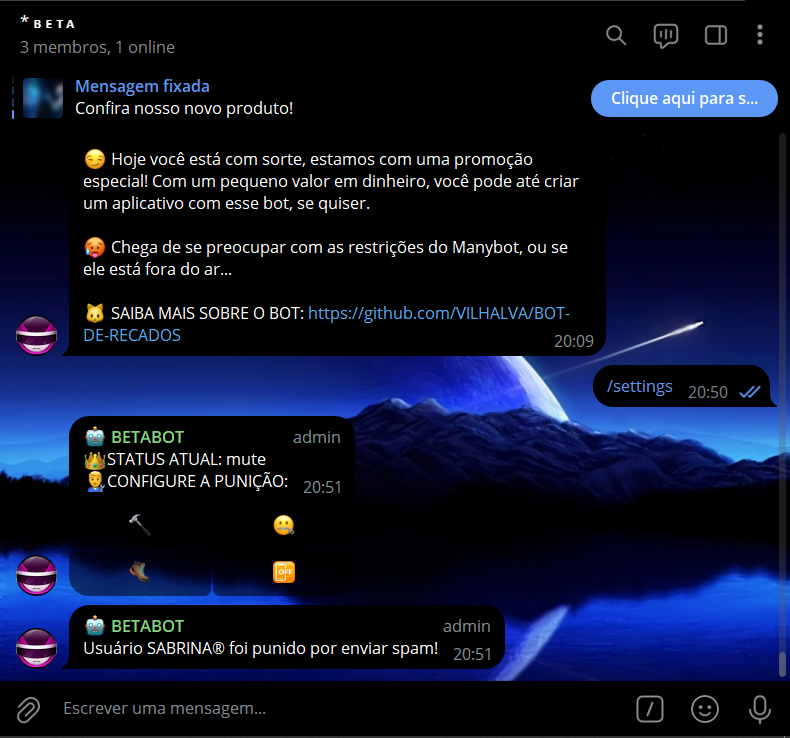
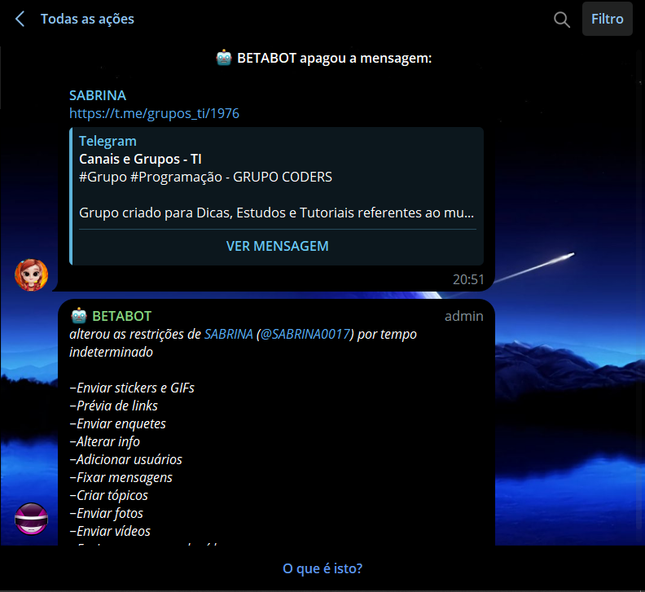
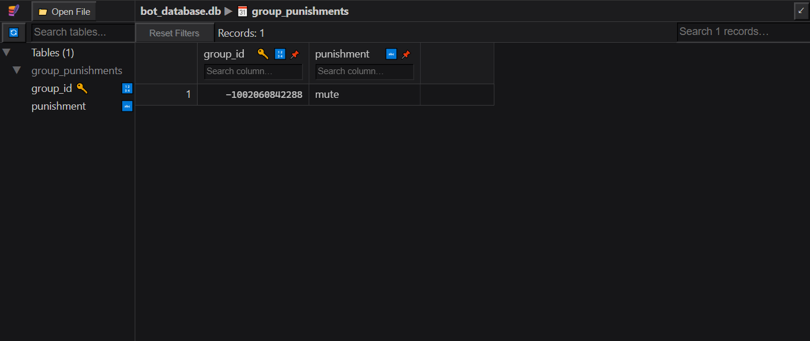

# MODERADOR ANTISPAM SQLITE
👮‍♂️ESSE É UM BOT DO TELEGRAM QUE PENALISA OS MEMBROS QUE ENVIAREM SPAM (COM PERSONALIZAÇÃO VIA SQLITE)!

 <br>
 <br>
 <br>

## DESCRIÇÃO:
Este bot implementa uma funcionalidade de configuração de punições para um grupo de Telegram. Ele permite que administradores do grupo configurem diferentes tipos de punições para usuários que enviam spam, como banimento, silenciamento, expulsão do grupo, ou desativar a punição.

## RECURSOS:
1. Quando um administrador do grupo digita o comando `/settings`, o bot verifica se o remetente é um administrador do grupo. Se for, ele busca a punição atualmente configurada para o grupo no banco de dados e exibe um painel de botões com opções de punição: banir, silenciar, expulsar ou desligar a função anti-spam.

2. Quando um administrador do grupo seleciona uma opção de punição no painel de botões, essa escolha é salva no banco de dados associado ao ID do grupo. Em seguida, a punição é aplicada ao membro alvo, se apropriado.

3. O bot também monitora mensagens de texto no grupo. Se detectar a presença de links em mensagens de não-administradores, o bot remove a mensagem e aplica a punição configurada para o grupo.

4. As configurações de punição são personalizáveis para cada grupo, permitindo que diferentes grupos tenham diferentes níveis de tolerância ao spam.

## EXECUTANDO O PROJETO:
1. **Coloque o Token:**
   - Antes de executar o programa, é necessário substituir o token do seu bot no arquivo `TOKEN.py`, o qual pode ser obtido por meio do [@BotFather](https://t.me/BotFather).

2. **Instalando as dependências:**
   - Antes de executar o bot, certifique-se de instalar todas as dependências necessárias. No terminal, execute o seguinte comando para instalar as dependências listadas no arquivo `requirements.txt` em `CODIGO`:
   ```bash
   pip install -r requirements.txt
   ```

3. **Inicie o Bot:**
   - Execute o bot do Telegram em Python iniciando-o com o seguinte comando:
   ```bash
   python CODIGO.py
   ```

4. **Adicione o bot ao Grupo:**
   - Adicione o bot ao grupo e dê as permissões de administrador. Então envie o comando `/settings` no grupo, e configure a punição clicando nos botões inlines conforme o desejar.

## NÃO SABE?
- Entendemos que para manipular arquivos em muitas linguagens e tecnologias relacionadas, é necessário possuir conhecimento nessas áreas. Para auxiliar nesse aprendizado, oferecemos alguns subsidios:
* [CURSO DE PYTHON](https://github.com/VILHALVA/CURSO-DE-PYTHON)
* [CURSO DE TELEBOT](https://github.com/VILHALVA/CURSO-DE-TELEBOT)
* [CURSO DE SQLITE](https://github.com/VILHALVA/CURSO-DE-SQLITE)
* [CONFIRA MAIS CURSOS](https://github.com/VILHALVA?tab=repositories&q=+topic:CURSO)

## CREDITOS:
- [PROJETO CRIADO PELO VILHALVA](https://github.com/VILHALVA)
